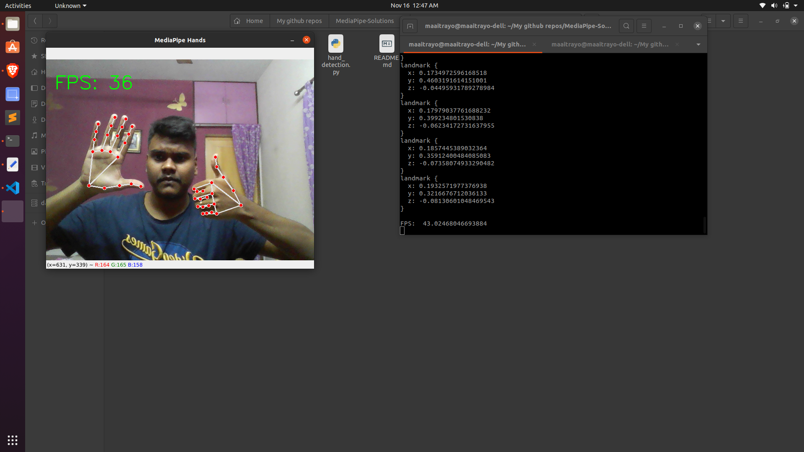
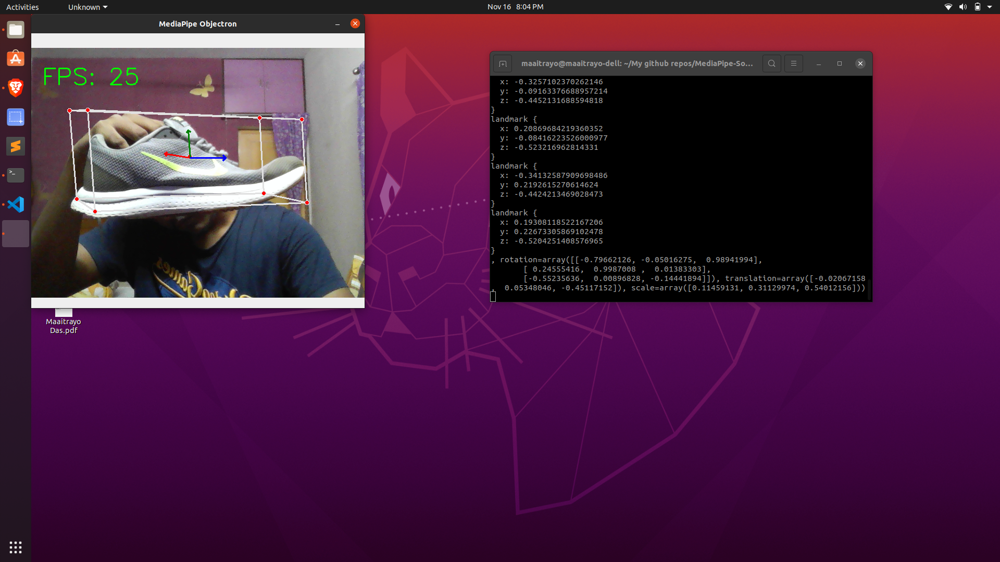
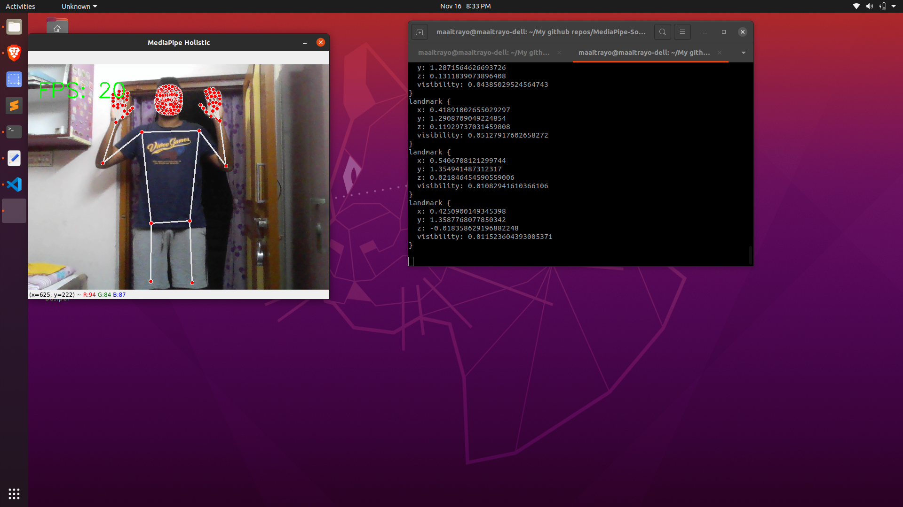

# MediaPipe-Solutions
Using MediaPipe and OpenCV for various machine learning tasks

## 1_face_detection:

## 2_face_mesh:

## 3_hand_detection:

## 4_3D_objectDetection:

## 5_holistic_detection:

